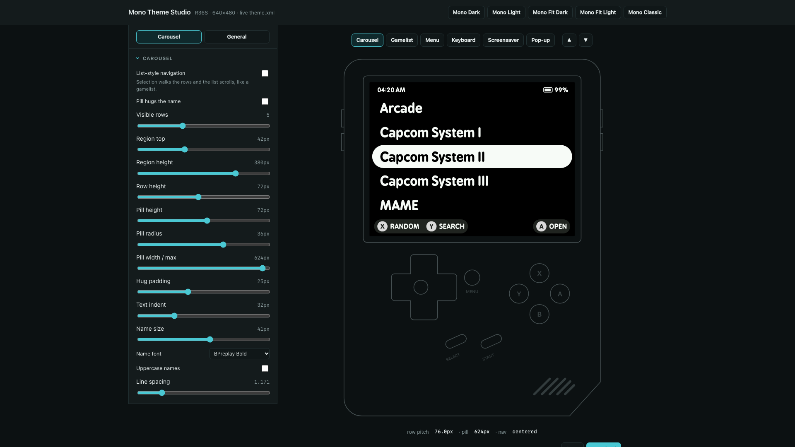
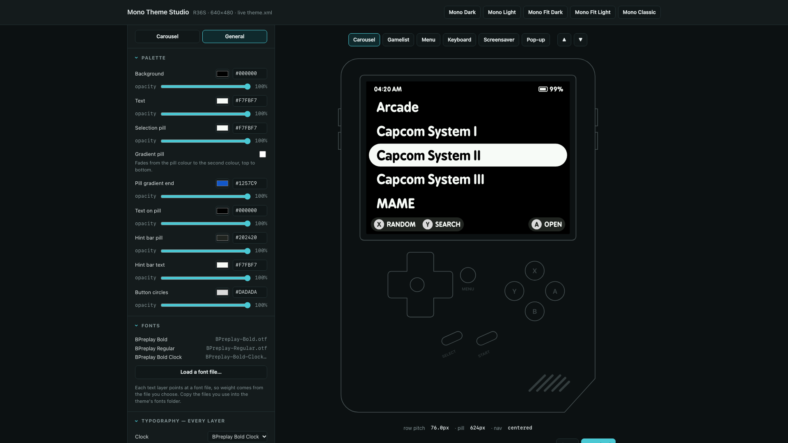

# Mono Theme Studio

A browser tool for designing **EmulationStation themes for the R36S** — the kind
of theme the [R36S Enhanced EmulationStation](https://github.com/scribbbler/R36S-Enhanced-EmulationStation)
build renders. Controls on the left, a true 640×480 device preview on the right,
and a ready-to-use `theme.xml` underneath that updates as you drag.

**Open `index.html` in any browser.** No build step, no dependencies, nothing
phones home. It works on a phone too: the device fills the screen and the
controls ride up in a bottom sheet.

## Why it exists

Theme values are stored as fractions of the screen, and font sizes have to be
divided by the engine's 1.31 boost — so a 41px name in a design becomes
`0.0652` in the file. This tool lets you work in the pixels you designed in and
does that conversion for you, then shows the result at the size it will actually
appear on the device, in the real font.

## What you can design

**Six screens**, each previewed live: carousel, gamelist, menu, on-screen
keyboard, screensaver clock, and the volume/brightness pop-up. **The mockup's
own buttons work** — press A on the carousel to open a gamelist, B to go back,
Y to reach the search keyboard, Select for the clock screensaver, Start for the
menu, and the d-pad to move the selection. It navigates the way the device does,
so you can walk a theme instead of inspecting it screen by screen.

- **Colour and opacity per layer** — every colour has an opacity slider, because
  the engine expresses opacity as the alpha byte of the colour.
- **Gradient selections** — a second colour fades top-to-bottom across the
  carousel, gamelist and menu pills (`selectorColorEnd`).
- **Typography per layer** — eleven independent font slots (clock, battery,
  carousel names, game names, system title, hint labels, menu rows, menu title,
  menu footer, screensaver clock, pop-up value). Load your own `.ttf`/`.otf`
  and it previews immediately. Row pitch is recalculated from the chosen
  face's real metrics, so spacing holds when you change fonts.
- **Pill geometry** — height, radius, fixed width or hug-the-text with padding
  and a maximum, plus list-style carousel navigation.
- **Swappable art** — battery, A/B/X/Y buttons, menu arrow, keyboard
  backspace/enter/shift icons, screensaver lock, pop-up icons. Load a file to
  preview it and set the path written into the theme.
- **Screen overlay** — a full-screen PNG over the whole interface (scanlines,
  LCD grid, dot matrix) with opacity and pixelated scaling, exported as a high
  z-index extra image.
- **System logos and game art** — switch the carousel from names to per-system
  logo images (`system/<id>.png`) with a logo box you can size, and place
  scraped game art beside the gamelist as the detailed view does. Load a sample
  image to see either in place.

The five **Mono** themes load as presets, so you can start from one and adjust.

## Opening an existing theme

**Import .zip** or **Import folder** reads a theme you already have: its colours,
fonts, sizes and pill geometry fill in the controls, its own font files register
for the preview, and its background art shows behind the mock-up. Zips are read
in the browser with no library — the central directory is walked by hand and
entries inflated with `DecompressionStream`.

## Using what it produces

**Download .zip** gives you a whole theme folder: the edited `theme.xml` plus
every font and image in use, and — if you imported a theme — everything else
from the original carried across untouched. Unzip into `/roms/themes/`.
Note the `theme.xml` is rewritten from the properties this tool manages, so
anything exotic in an imported file is not preserved.

## Using what it produces (by hand)

1. Copy an existing theme folder (for example `Mono Dark`) to a new name.
2. Replace its `theme.xml` with the one this tool gives you.
3. Copy any fonts and art you loaded into that folder's `fonts/` and `art/`.
   The file's header comment lists the font files it needs.
4. Put the folder in `/roms/themes/` and pick it in *UI Settings → Theme*.

## Accuracy, and its limits

The preview is arithmetic from the same formulas the engine uses, and it draws
with the real BPreplay faces, so text measures as it will on the device. Two
things are deliberately shown as fixed because the theme cannot change them:
**menu row pitch and pill width**, and the **hint-bar labels**, which come from
the build. A few values (row pitch from line spacing) are derived from font
metrics and can land a pixel out; check on the device before calling it final.

## Licence

The tool is MIT licensed. **BPreplay** is bundled for the preview and remains
under its own licence — it is not part of the MIT grant.
