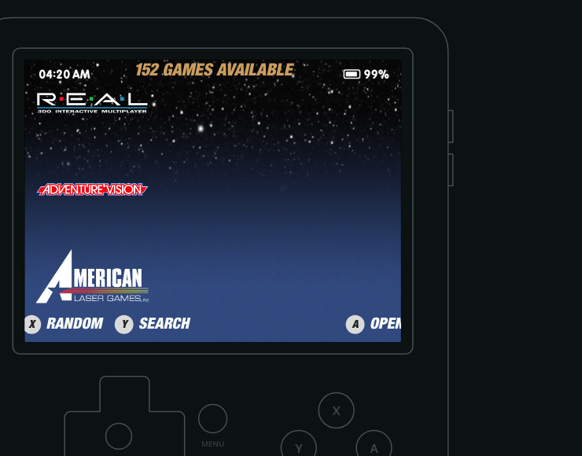

# Mono Theme Studio

A browser tool for designing **EmulationStation themes for the R36S** — the kind
of theme the [R36S Enhanced EmulationStation](https://github.com/scribbbler/R36S-Enhanced-EmulationStation)
build renders. Controls on the left, a true 640×480 device preview on the right,
and a ready-to-use `theme.xml` underneath that updates as you drag.

**Open `index.html` in any browser.** No build step, no dependencies, nothing
phones home. It works on a phone too: the device fills the screen and the
controls ride up in a bottom sheet.

## Why it exists

Theme values are stored as fractions of the screen, and font sizes have to be
divided by the engine's 1.31 boost — so a 41px name in a design becomes
`0.0652` in the file. This tool lets you work in the pixels you designed in and
does that conversion for you, then shows the result at the size it will actually
appear on the device, in the real font.

## What you can design

**Six screens**, each previewed live: carousel, gamelist, menu, on-screen
keyboard, screensaver clock, and the volume/brightness pop-up. **The mockup's
own buttons work** — press A on the carousel to open a gamelist, B to go back,
Y to reach the search keyboard, Select for the clock screensaver, Start for the
menu, and the d-pad to move the selection. It navigates the way the device does,
so you can walk a theme instead of inspecting it screen by screen.

- **Colour and opacity per layer** — every colour has an opacity slider, because
  the engine expresses opacity as the alpha byte of the colour.
- **Gradient selections** — a second colour fades top-to-bottom across the
  carousel, gamelist and menu pills (`selectorColorEnd`).
- **Typography per layer** — eleven independent font slots (clock, battery,
  carousel names, game names, system title, hint labels, menu rows, menu title,
  menu footer, screensaver clock, pop-up value). Load your own `.ttf`/`.otf`
  and it previews immediately. Row pitch is recalculated from the chosen
  face's real metrics, so spacing holds when you change fonts.
- **Pill geometry** — height, radius, fixed width or hug-the-text with padding
  and a maximum, plus list-style carousel navigation.
- **Swappable art** — battery, A/B/X/Y buttons, menu arrow, keyboard
  backspace/enter/shift icons, screensaver lock, pop-up icons. Load a file to
  preview it and set the path written into the theme.
- **Screen overlay** — a full-screen PNG over the whole interface (scanlines,
  LCD grid, dot matrix) with opacity and pixelated scaling, exported as a high
  z-index extra image.
- **System logos and game art** — switch the carousel from names to per-system
  logo images (`system/<id>.png`) with a logo box you can size, and place
  scraped game art beside the gamelist as the detailed view does. Load a sample
  image to see either in place.

The five **Mono** themes load as presets, so you can start from one and adjust.

## Stock ES or this build

A switch in the header decides which engine the preview and the export target.
**Stock ES** dims unselected entries, enlarges the selected one by `logoScale`,
leaves the battery in the UI font, and writes a `theme.xml` with none of this
build's own properties. Its button-hint bar follows stock's rules exactly: the
views decide which prompts appear and a theme cannot drop any, the labels are
always uppercased, and each icon is drawn at a size stock derives from the hint
font — 8px from its label, 16px from the next prompt, with no background. A
theme *can* point the icon slots at its own images (stock reads `iconA`,
`iconB`, `iconX`, `iconY`, `iconL`, `iconR`, `iconStart`, `iconSelect` and the
three d-pad paths); load art for one and the preview uses it, otherwise it draws
the glyph the stock binary ships. Size, spacing, labels and a pill behind them
are this build's additions, so those controls grey out. **This build** turns on the additions: selection pills,
gradients, fit-content pills, list navigation, keyboard styling and the
screensaver clock. Importing a theme picks the right side for you.

## Opening an existing theme

**Import .zip** or **Import folder** reads a theme you already have: its colours,
fonts, sizes and pill geometry fill in the controls, its own font files register
for the preview, and its background art shows behind the mock-up. Zips are read
in the browser with no library — the central directory is walked by hand and
entries inflated with `DecompressionStream`.

It also reads the machinery bigger themes are built out of. `${variables}` are
resolved, including the ones an included file defines, so a theme written almost
entirely in named colours arrives with real values. A `<subset>` — the menu
choices a theme offers, like a colour scheme or an aspect ratio — resolves to
its first option, which is what a freshly installed theme shows. Properties
merge across files the way the engine merges them, so a carousel defined in one
file and adjusted in another keeps both halves. Carousels can be horizontal as
well as vertical.

One caveat worth knowing, because it decides what you see: **this fork has no
`ifSubset` support.** A theme that guards blocks with `ifSubset` — Art Book Next
is the well-known one — has every guarded block applied on the device, in file
order, the last one winning, rather than only the one matching your menu
choice. The preview reproduces that, so a theme offering seven colour schemes or
six aspect ratios resolves here to the same one it resolves to on the R36S, even
when that isn't the one the theme's author intended you to get.

Real themes vary a lot, so the importer is deliberately forgiving: it follows
`<include>` files, accepts an XML declaration that sits after a comment (which
the device's parser tolerates and some published themes rely on), takes the last
definition when a property is set more than once, ignores values that aren't
numbers or valid hex, and falls back to the typeface the theme uses most when a
text layer is named something it doesn't recognise. Values outside this tool's
slider ranges are clamped, and it tells you how many.

## Customizing on the device too

The browser tool is one of three routes, and not always the one you want. The
R36S build's **[CUSTOMIZING-THEMES.md](https://github.com/scribbbler/R36S-Enhanced-EmulationStation/blob/main/CUSTOMIZING-THEMES.md)**
covers the other two — the accent colour and font size every Mono theme exposes
in the device's own menu, and the fonts, icons and backgrounds you can replace
by dropping files on the card.

## Using what it produces

**Download .zip** gives you a whole theme folder: the edited `theme.xml` plus
every font and image in use, and — if you imported a theme — everything else
from the original carried across untouched. Unzip into `/roms/themes/`.
Note the `theme.xml` is rewritten from the properties this tool manages, so
anything exotic in an imported file is not preserved.

## Using what it produces (by hand)

1. Copy an existing theme folder (for example `Mono Dark`) to a new name.
2. Replace its `theme.xml` with the one this tool gives you.
3. Copy any fonts and art you loaded into that folder's `fonts/` and `art/`.
   The file's header comment lists the font files it needs.
4. Put the folder in `/roms/themes/` and pick it in *UI Settings → Theme*.

## Accuracy, and its limits

The preview is arithmetic from the same formulas the engine uses, it draws with
the real fonts, and icons are tinted through their own alpha the way the engine
tints them — so a white logo lands black on a light selection pill here exactly
as it does on the device. Two
things are deliberately shown as fixed because the theme cannot change them:
**menu row pitch and pill width**, and the **hint-bar labels**, which come from
the build. A few values (row pitch from line spacing) are derived from font
metrics and can land a pixel out; check on the device before calling it final.

## Licence

The tool is MIT licensed. **BPreplay** is bundled for the preview and remains
under its own licence — it is not part of the MIT grant.
